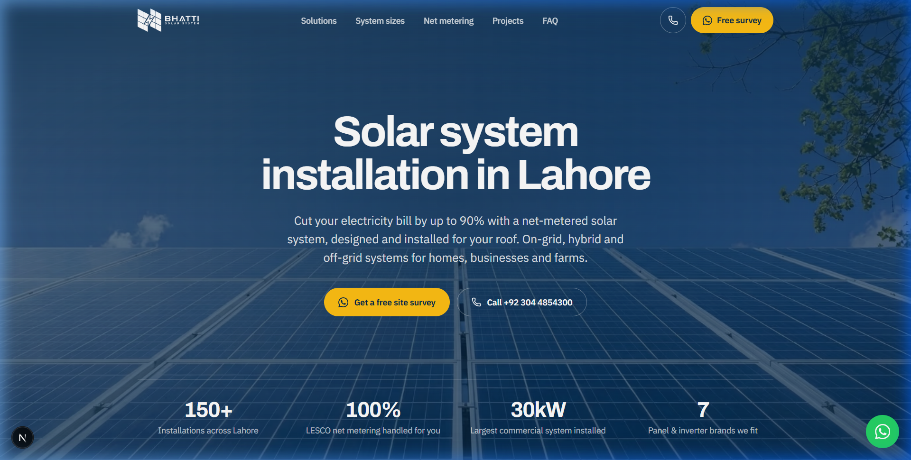
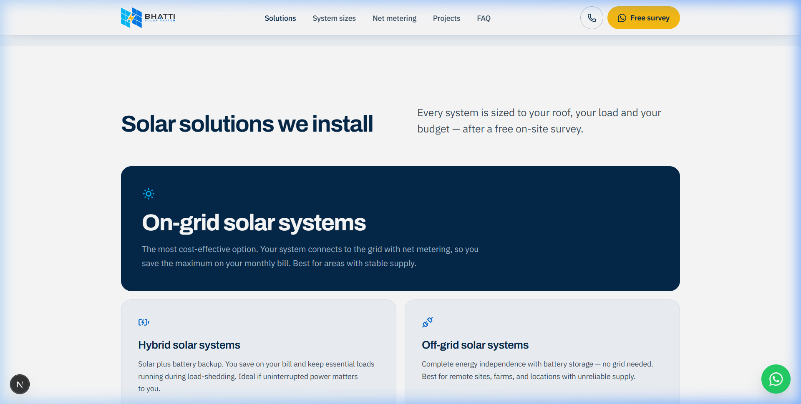
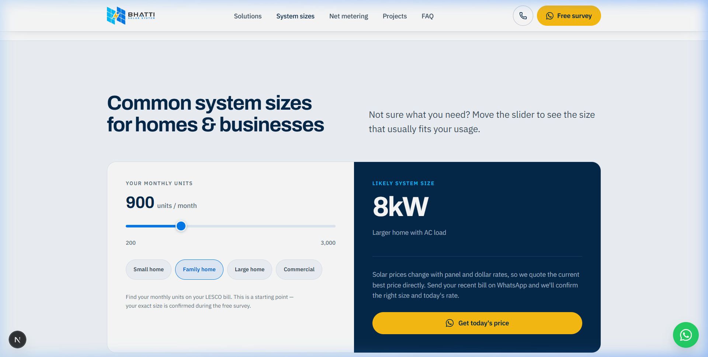
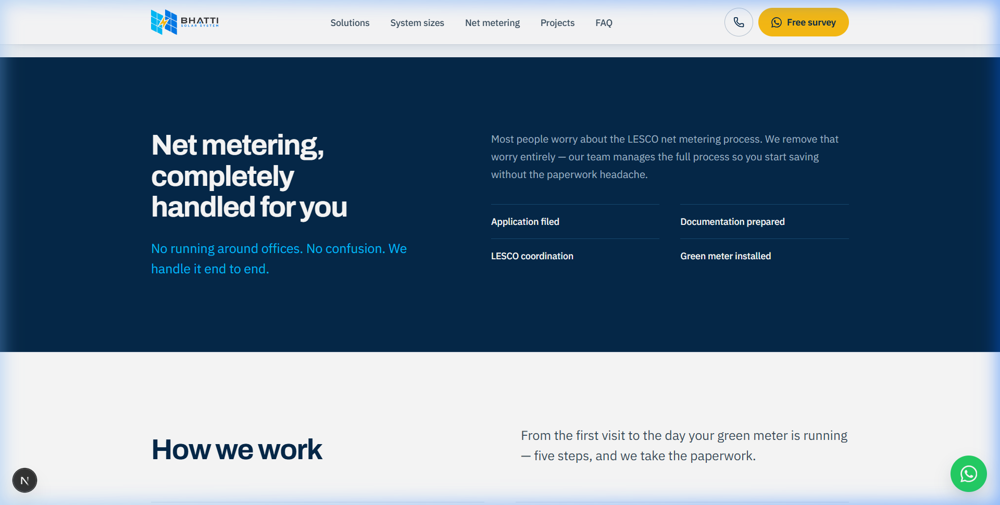

<div align="center">

  # ☀️ Bhatti Solar System
  ### Premium Solar Energy & Net Metering Platform in Lahore

  A modern, high-converting marketing & web application built for **Bhatti Solar System**. Designed with sleek aesthetics, interactive system calculators, and seamless lead generation flows.

  [](https://nextjs.org/)
  [](https://react.dev/)
  [](https://www.typescriptlang.org/)
  [](https://tailwindcss.com/)

  <br />

  

</div>

<br />

---

## 🌟 Key Features

- ⚡ **Interactive System Sizer**: Drag-and-drop monthly electricity unit slider (200 – 3,000 units/mo) to automatically calculate recommended system sizes (5kW, 8kW, 10kW, 15kW, 20kW+).
- ☀️ **Tailored Solar Solutions**: In-depth breakdowns of **On-Grid**, **Hybrid** (battery backup), and **Off-Grid** solar setups with detailed specs and modal dialogs.
- 🔄 **LESCO Net Metering Guide**: Clear 5-step roadmap covering site surveys, green meter installations, and grid connectivity.
- 💬 **Instant WhatsApp Lead Generation**: Direct click-to-chat CTAs with pre-filled messages for site survey scheduling and custom quotes.
- 🎨 **Modern Minimalist UI**: Glassmorphic headers, responsive layouts, high-contrast dark hero visuals, and micro-interactions powered by Tailwind CSS v4.

---

## 🖼️ Application Preview

<table width="100%">
  <tr>
    <td width="50%" align="center">
      <h4>Solar Solutions Overview</h4>
      
    </td>
    <td width="50%" align="center">
      <h4>Interactive System Calculator</h4>
      
    </td>
  </tr>
  <tr>
    <td colspan="2" align="center">
      <h4>LESCO Net Metering Workflow</h4>
      
    </td>
  </tr>
</table>

---

## 🛠️ Tech Stack

| Technology | Role |
| :--- | :--- |
| **Framework** | [Next.js 16](https://nextjs.org) (App Router) |
| **UI Library** | [React 19](https://react.dev) |
| **Styling** | [Tailwind CSS v4](https://tailwindcss.com) |
| **Icons** | [Lucide React](https://lucide.dev) |
| **Language** | [TypeScript 5.9](https://www.typescriptlang.org) |
| **Linter** | [Oxlint](https://github.com/oxc-project/oxc) |

---

## 🚀 Quick Start

### Prerequisites

Make sure you have **Node.js 18+** and **pnpm** installed.

### Installation

1. **Clone the repository**
   ```bash
   git clone https://github.com/ShakeelMehar/solar-saas.git
   cd solar-saas
   ```

2. **Install dependencies**
   ```bash
   pnpm install
   ```

3. **Run the development server**
   ```bash
   pnpm dev
   ```

4. Open [http://localhost:3000](http://localhost:3000) in your browser to view the app.

---

## 📁 Directory Structure

```text
solar-saas/
├── docs/
│   └── assets/              # Screenshots & documentation assets
├── public/                  # Favicon and static files
└── src/
    ├── app/                 # Next.js App Router (pages & layout)
    ├── assets/              # Logos, hero images, and branding assets
    ├── components/          # Reusable UI components (Navbar, Calculator, Solutions)
    └── lib/                 # Shared data constants & WhatsApp helpers
```

---

## 📜 Available Scripts

| Command | Action |
| :--- | :--- |
| `pnpm dev` | Starts local development server on port 3000 |
| `pnpm build` | Builds optimized production bundle |
| `pnpm start` | Serves the production build |
| `pnpm lint` | Runs Oxlint code inspection |

---

<div align="center">

  Designed with ❤️ for **Bhatti Solar System Lahore**

</div>
